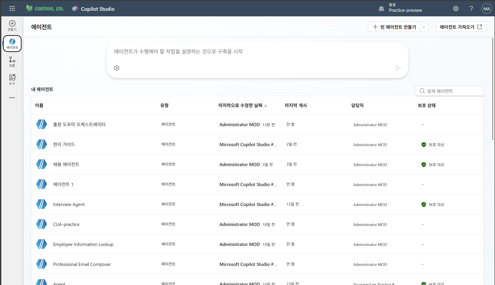

# 에이전톤 로우코드 데이: Copilot Studio편 실습 가이드

**작성자: Solution Engineer 이영서**

## 1. 실습의 최종 목표 한눈에 보기

- 이번 실습은 1. Multi_Agent_Guide.md를 이미 진행한 후에 진행하는 두 번째 실습입니다.
- Agent의 Trigger를 간단하게 다뤄볼 예정입니다. 
- 간단하게, "출장"이라는 제목의 메일이 오면 메일 본문에 따라 에이전트가 실행되도록 해보겠습니다. 
- 이 실습은 Optional입니다. 


### 배경 지식: 이벤트 트리거 
- 우리는 Trigger를 통해 특정 이벤트가 발생했을 때 에이전트가 동작하도록 지정할 수 있습니다.
- 이것을 이벤트 트리거라고도 부릅니다.
    - 쉽게 설명하면, 사용자의 메시지 없이도 다른 시스템에서 특정 사건이 발생했을 때 에이전트가 스스로 행동하게 만드는 것입니다.
    - e.g. “새 Sharepoint 항목 생성“, “새 이메일 도착＂과 같은 이벤트 발생하면 커넥터가 트리거의 Payload(변수+ 지시/메시지)를 에이전트에게 전송 
    - 에이전트는 트리거 payload에 포함된 지시/정보를 참고하여, 지침에 따라 도구 선택 및 토픽 실행 


## 2. 실습
1. 트리거 추가

2. 여러 트리거 중, **새 메일이 도착하면(V3)** 클릭


3. 트리거 조건 설정
* 폴더: Inbox
* 제목 필터: 출장


* **이 트리거에 의해 호출될 때 에이전트에 대한 추가 지침** 섹션 수정

본문 변수는 남겨두고, 그 뒤에 아래 텍스트를 붙여 넣은 후 트리거 생성 클릭 
```text
의 콘텐츠를 사용자의 요청처럼 이해하세요. 출장 관련 얘기가 나오면 내용에 따라 적절하 에이전트 혹은 토픽을 실행시킵니다. 
```
## 3. 테스트

1. [outlook](https://outlook.office.com/)에 들어갑니다.
2. **출장**이 들어가도록 자기 자신에게 메일을 씁니다. 

3. 다시 Copilot Studio로 돌아가서 에이전트의 트리거 섹션 내의 **트리거 테스트** 버튼을 클릭합니다.

